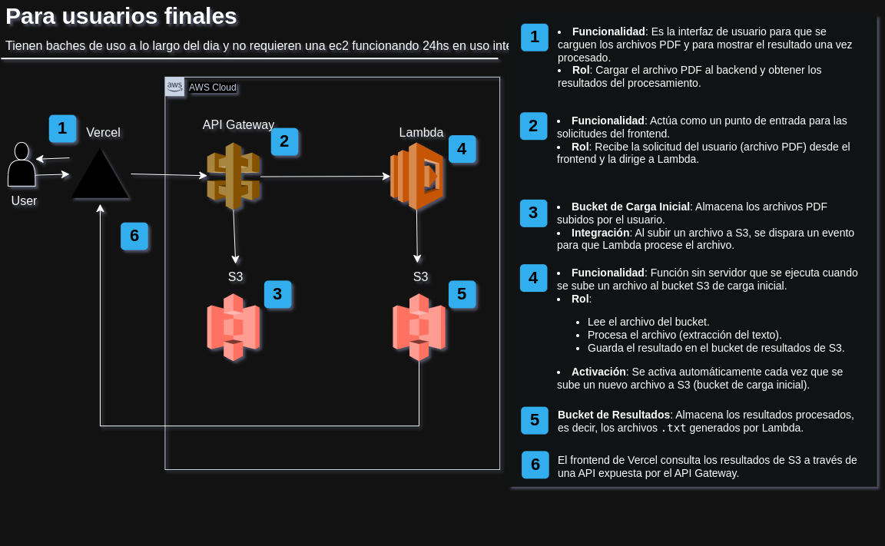
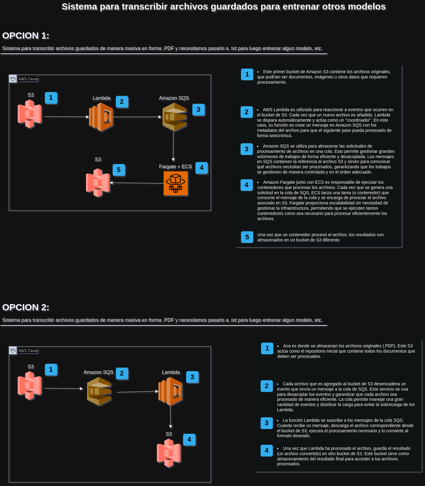

# MRM ANALYTICS - PRUEBA TEPSICH

# PDF a Texto
Este proyecto es un servicio backend basado en FastAPI, diseñado para extraer texto de archivos PDF y proporcionar una API RESTful para gestionar las cargas de archivos y la extracción de texto. El proyecto es escalable y puede manejar fácilmente diferentes tipos de PDFs a través de una arquitectura modular de extractores.

## Sobre el codigo:
En la carpeta "app"(backend), en cada una de las subcarpetas esta un archivo .md el cual explica la importancia de esa subcarpeta 

## Cómo Funciona
1. **Carga de Archivos**: El usuario carga un archivo PDF a través del frontend (o Postman) mencionando el tipo de documento a extraer.
2. **Extractores**: Dependiendo del tipo de PDF, se utiliza un extractor correspondiente:
   - **Extractor Documento Test1**: Para PDFs estructurados, extrayendo texto con formato.
   - **Extractor Documento Test2**: Para PDFs basados en imágenes, utilizando Reconocimiento Óptico de Caracteres (OCR).
3. **Almacenamiento Temporal**: El archivo cargado se guarda temporalmente, se procesa y luego se elimina.
4. **Procesamiento Dinámico**: Los extractores utilizan diferentes métodos como PDFMiner para texto estructurado y Tesseract (OCR) para documentos escaneados.
5. **Salida**: El texto procesado se devuelve como respuesta.

## Características Clave

- **Escalabilidad**: Permite agregar nuevos extractores para otros tipos de documentos sin realizar grandes cambios en el código.
- **Preparado para la Nube**: Diseñado para ejecutarse en un contenedor Docker para escalabilidad y despliegue en entornos en la nube.
- **Gestión Dinámica de Extractores**: Utiliza un gestor de estructuras para registrar y gestionar extractores de manera dinámica, haciéndolo extensible para nuevos tipos de documentos.
- **Gestión de Recursos**: Los archivos temporales se limpian automáticamente para evitar desbordamientos de memoria.

## Estructura de Carpetas

- **app**: Contiene la lógica principal del servicio de extraccion, incluyendo los endpoints.
  - **api**: Define los endpoints RESTful para interactuar con el servicio.
    - **v1**: Contiene las rutas de la versión 1 de la API, como la carga y extracción de PDFs.
  - **services**: Contiene la lógica para extraer texto de los PDFs.
    - **extractors**: Cada extractor específico está implementado aquí (ej. Test1Extractor, Test2Extractor). Cada uno de estos extractores se encarga de procesar diferentes tipos de documentos.
    - **utils**: Funciones auxiliares comunes, como la de convertir pdf a imagen, que se utilizan en los extractores y otros servicios.
- **tests**: Pruebas automatizadas para validar la funcionalidad del proyecto. Aquí se encuentran los tests unitarios para los extractores y otras funcionalidades clave del sistema.

## Requisitos

- Python 3.10
- Node.js 18.18.0
- Docker

## Ejecutar el Proyecto


### Backend:
1. **Construir Docker**:
   ```sh
   cd app
   docker build -t pdf-extractor-backend -f Dockerfile.backend .
   ```
2. **Ejecutar Docker**:
   ```sh
   docker run -d -p 8000:8000 pdf-extractor-backend
   ```

3. **Endpoints de la API**:
   - Cargar un PDF y extraer texto: `POST /api/v1/extract-pdf`

### Frontend:
1. **Instalar package**:
   ```sh
   cd pdf-extractor-frontend
   npm install
   ```

2. **Correr app**:
   ```sh
   npm run dev -- -p 3000
   ```


## Infraestructura en la Nube (AWS)
Las arquitecturas que se presentan a continuacion, pueden variar en base al tipo de problema.
Cada servicio puede ser implementado de distintas maneras en base al problema especifico.
En este caso trate de suponer 3 situaciones distintas, las cuales cada una tienen sus ventajas respecto a las otras.

### Infraestructura para un usuario final (ej: estudio juridico)



### Infraestructura para un transcribir datos masivos (ej: transcribir datos para entrenar un modelo con esa informacion)
Presento 2 opciones para un mismo problema. La eleccion de una u otra depende de los tipos de archivos y la cantidad.



